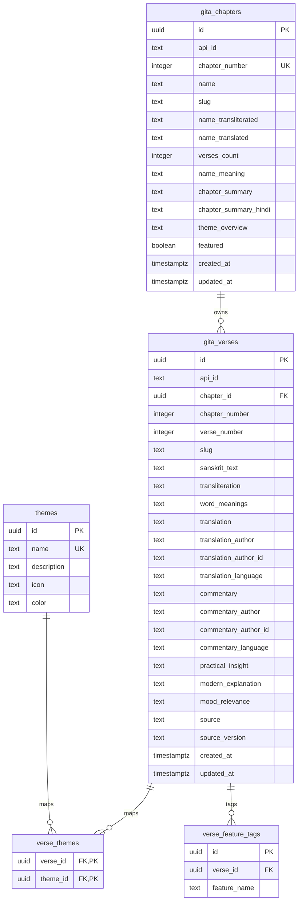

# Project Architecture Reference

This document details the project codebase organization and database schemas for the Happy Soul platform.

---

## 1. Directory Structure

```text
components/
├── dashboard/
│   ├── layout/
│   │   ├── DashboardHeader.jsx    # Page header & profile status banner
│   │   └── DashboardGrid.jsx      # Widget column composer
│   │
│   ├── widgets/
│   │   ├── WelcomeCard.jsx        # Client time greeting card
│   │   ├── ThoughtCard.jsx        # Cycles quotes via provider
│   │   ├── ProgressCard.jsx       # Daily statistics SVG indicator
│   │   ├── WellnessJourney.jsx    # Goals & interests chips
│   │   ├── RecommendationCard.jsx # Curated placeholder cards
│   │   └── ComingSoon.jsx         # Features timeline roadmap
│   │
│   └── actions/
│       └── QuickActions.jsx       # Interactive actions grid
│
└── thoughts/
    ├── ThoughtCategory.jsx        # Dynamically colored category badge
    ├── ThoughtActions.jsx         # Action row (copy, share, favorites, dev next button)
    └── ThoughtSkeleton.jsx        # Pulsing shimmer loading layout

lib/
├── supabase/
│   ├── client.js                  # Client supabase client
│   ├── server.js                  # Server supabase client
│   └── middleware.js              # Session refresh middleware
│
├── thoughts/
│   ├── schema.js                  # Thought object structure reference
│   ├── dataset.js                 # Curated local quotes collection (100+ items)
│   ├── constants.js               # UI localization labels
│   ├── hash.js                    # Deterministic date hashing
│   ├── selector.js                # Onboarding personalization logic
│   └── provider.js                # Unified daily quotes provider interface
│
└── gita/
    ├── schema.js                  # Chapter, Verse, and Theme schema declarations
    ├── config.js                  # External dataset URLs and import defaults
    ├── constants.js               # Feature tags, translators, and default themes
    └── index.js                   # Gita module entrypoint
```

---

## 2. Rationale for Reorganization

* **Component Decoupling**: Placing layout and grid components separate from standalone cards (widgets) simplifies the responsive layout structure.
* **Granular Directory Scaling**: As upcoming features (Krishna AI, Journal, etc.) are introduced, they maintain separate `widgets/` and `actions/` directories without cluttering a single flat dashboard directory.
* **Shared Components Foundation**: General cards use primitives from `components/ui/` to enforce UI styling uniformity across light and dark modes.

---

## 3. Provider Pattern Implementation

* **Data Isolation**: UI components do not query database structures directly. Instead, they reference provider interfaces (e.g. `getDailyThought(profile)`).
* **Flow Architecture**:
  ```text
  Dashboard Card (UI)
        ↓
  provider.js (getDailyThought)
        ↓
  selector.js (Filter & Score)
        ↓
  dataset.js (Thoughts list)
  ```
* **AI Readiness**: Swapping providers to fetch dynamic outputs from the Gemini API or a Supabase endpoint requires zero changes in the React UI layout files.

---

## 4. Krishna Wisdom Library Database Architecture (Phase 6A.1)

To support future scriptural retrievals, Krishna AI chatbots, daily verses, and mood guidance, we designed a normalized relational database schema in Supabase.

### 4.1 Database Entity Relationship (ER) Diagram


### 4.2 Dataset-to-Database Mapping
The schema is designed to mirror the open-source Bhagavad Gita dataset (`https://ravisiyer.github.io/gita-data/v1`).
* **Source Mirroring**: Relational tables (`gita_chapters` and `gita_verses`) map fields such as `name_transliterated`, `sanskrit_text`, `transliteration`, and `word_meanings` directly from the source API structure. This ensures a one-time import pipeline can seed the database without structural friction.
* **Supabase as permanent source of truth**: Running external API requests during runtime makes the application fragile and slow. Therefore, after the one-time seeding process in Phase 6A.2, Supabase acts as the permanent local knowledge repository.

### 4.3 Happy Soul Extensions
To support wellness and gamified recommendations, the database incorporates fields outside the basic scriptural dataset:
* **Wellness Themes**: The `themes` table stores categories like *Peace*, *Anxiety*, *Courage*, and *Discipline*. The `verse_themes` table maps verses to these themes, enabling mood-sensitive guidance.
* **Feature Tags**: The `verse_feature_tags` table tags specific verses for features (e.g. `daily_thought`, `krishna_ai`, `meditation`), allowing distinct query filtering per module.
* **Enrichment Fields**: Columns like `practical_insight`, `modern_explanation`, and `mood_relevance` in `gita_verses` are reserved for AI-enriched copy generated in later phases.

### 4.4 Future AI Grounding & Retrieval
* **Retrieval Augmented Generation (RAG)**: When a user chats with the Krishna AI bot (Phase 6B), the bot will query `gita_verses` matching user tags/moods to retrieve scriptural text. The retrieved text will be passed to the LLM (Gemini) as ground-truth context (grounding), preventing AI hallucinations.
* **Semantic Search & Embeddings**: The primary keys and columns are set up to support adding `vector` columns in a future migration, enabling pgvector semantic search (similarity queries on verse translations and commentaries).
