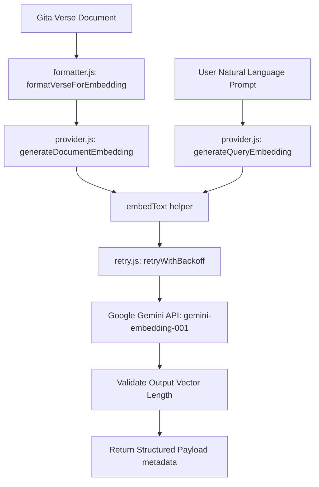

# Bhagavad Gita Vector Embeddings Domain Layer

This document outlines the architecture, design choices, database schema, and operational instructions for generating and querying semantic vector representations of the Bhagavad Gita knowledge library.

---

## 1. Context & Architectural Strategy

### Why Embeddings are Required
Traditional keyword search fails to capture the conceptual essence of user queries. For example, a user searching for *"how to handle grief"* would miss verses discussing *"grief"* under terms like *"sorrow"*, *"mourning"*, or *"lamentation"*. Semantic vector representations translate natural language documents into dense multi-dimensional points where similar ideas cluster closely, enabling conceptual and context-aware queries.

### Why pgvector?
`pgvector` is a native open-source PostgreSQL extension allowing vector storage and similarity searches. Using `pgvector` inside our primary Supabase Postgres instance avoids:
* Maintaining a separate vector database (e.g. Pinecone, Milvus).
* Dealing with cross-database sync pipelines and distributed transactions.
* Performance penalties from join operations across different storage systems.

### Why gemini-embedding-001?
We use Google's `gemini-embedding-001` model:
* **Dimensions**: 768 dimensions (configured using the Matryoshka Representation Learning parameter `outputDimensionality`).
* **Retrieval Optimized**: Specifically designed for RAG retrieval tasks.
* **Cost Efficiency**: High-performance, scalable API.
* **Normalized Outputs**: The model outputs unit-normalized vectors. This makes cosine similarity mathematically identical to dot product operations, leading to extremely fast query executions.

---

## 2. Database Schema Modifications

### Table: public.gita_verses
The table is extended with the following vector and execution metadata columns:
* `embedding` vector(768): Vector coefficients array.
* `embedding_model` text: Model key (e.g. `'gemini-embedding-001'`).
* `embedding_version` text: Config version (e.g. `'v1'`).
* `embedding_text_version` integer: Formatter version identifier (default `1`).
* `embedded_at` timestamptz: Vector generation timestamp.

### Index: IVFFLAT (Cosine Similarity)
An IVFFLAT index is configured using the `vector_cosine_ops` operator class:
```sql
create index if not exists gita_verses_embedding_ivfflat_idx
  on public.gita_verses
  using ivfflat (embedding vector_cosine_ops)
  with (lists = 10);
```
Cosine similarity is selected because it evaluates the orientation angle of vectors irrespective of document magnitude. This is perfect for searching text where sanskrit verses, translations, and commentaries differ heavily in word count.

---

## 3. Modular Architecture & Workflows

All embedding logic is decoupled under the `lib/embeddings/` domain:
1. **config.js**: Holds variables like model names, dimensions, timeouts, retry counts, and versions. Both document and query pipelines share this single configuration.
2. **constants.js**: Exports task types `TASK_TYPES.RETRIEVAL_DOCUMENT` and `TASK_TYPES.RETRIEVAL_QUERY`.
3. **schema.js**: Documents `QueryEmbeddingRequest`, `QueryEmbeddingResponse`, and `EmbeddingMetadata` payload patterns using JSDoc.
4. **retry.js**: Performs retries on transient network/HTTP errors (like 429, 500, 503, timeouts) with exponential backoff, while ignoring non-transient mistakes (like invalid API keys).
5. **formatter.js**: Compiles Sanskrit text, transliteration, meanings, Swami Sivananda translation, and commentaries into one structured document. If enrichment columns (`practical_insight`, `modern_explanation`) are populated in future phases, it automatically appends them without requiring formatter rewrites.
6. **provider.js**: Exposes unified, provider-agnostic APIs:
   * `generateDocumentEmbedding(text, options = {})`
   * `generateQueryEmbedding(userPrompt, options = {})`

### Shared Provider Architecture


### Consistency Requirement
Document embeddings (representing verse content) and query embeddings (representing user search requests) **must always use the same configuration parameters** (model name, output dimensions, and versioning constraints). If these parameters mismatch, comparing their vector alignment via cosine similarity becomes mathematically invalid.

---

## 4. Operational Instructions & Seeding

To generate embeddings for all 701 verses, run:
```bash
npm run db:embed-gita
```

### Seeding Features:
* **Smart Skip Logic**: The seeder skips verses that already contain a valid vector matching the current model, version, and formatter version.
* **Batch Strategy**: Computes and updates vectors in batches of 25 to prevent rate limiting, manage memory footprints, and restrict retry scopes.
* **Sequential API Throttling**: Loops through each verse sequentially inside the batch, awaiting the embedding API response, and sleeps 2000ms (2 seconds) between calls to avoid 429 rate limit errors on the free tier.
* **Production Logging**: Outputs batch status cards with elapsed time, ETA progress, batch indices, and failure tracking.
* **seed_metadata Audit**: Inserts execution summaries (model, dimensions, rows embedded, version, completed time) to the audit log upon completion.

---

## 5. Future Semantic Retrieval Integration

In the upcoming Phase 6A.6, the **Semantic Retrieval Engine** will consume the query embedding generated by `generateQueryEmbedding`. The pipeline will execute:
1. Generate the query vector `q` for the user prompt.
2. Call a Supabase Postgres RPC function calculating cosine similarity:
   `1 - (gita_verses.embedding <=> q)`
3. Retrieve the top-$k$ verses.
4. Execute profile-aware hybrid ranking on the results before sending them to the Krishna AI generation module.
